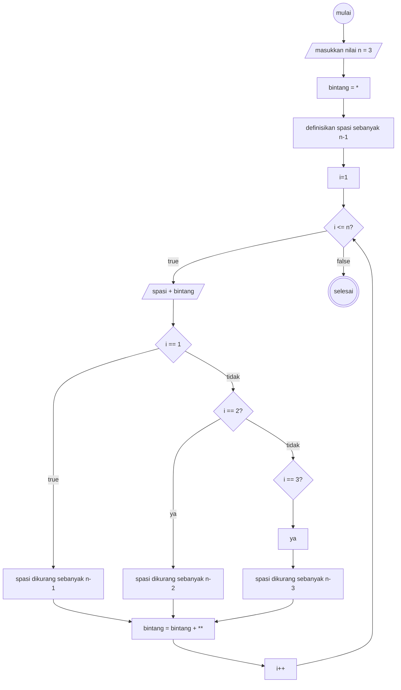

```mermaid
flowchart TD
    start((mulai))-->input[/masukkan nilai n = 3/]
    input --> bintang[bintang = *]
    bintang --> spasi[definisikan spasi sebanyak n-1]
    spasi --> definisi[i=1]
    definisi --> kondisi{i <= n?}
    kondisi -- true --> cetak[/spasi + bintang/]
    kondisi -- false --> selesai(((selesai)))
    cetak--> cek{i == 1}
    cek -- true --> Spasi1[spasi dikurang sebanyak n-1]
    cek -- tidak --> cek2{i == 2?}
    cek2 -- ya --> spasi2[spasi dikurang sebanyak n-2]
    cek2 -- tidak --> cek3{i == 3?}
    cek3 --> ya --> spasi3[spasi dikurang sebanyak n-3]

    Spasi1 --> lanjut[bintang = bintang + **]
    spasi2 --> lanjut
    spasi3 --> lanjut

    lanjut --> increment[i++]
    increment --> kondisi
```
